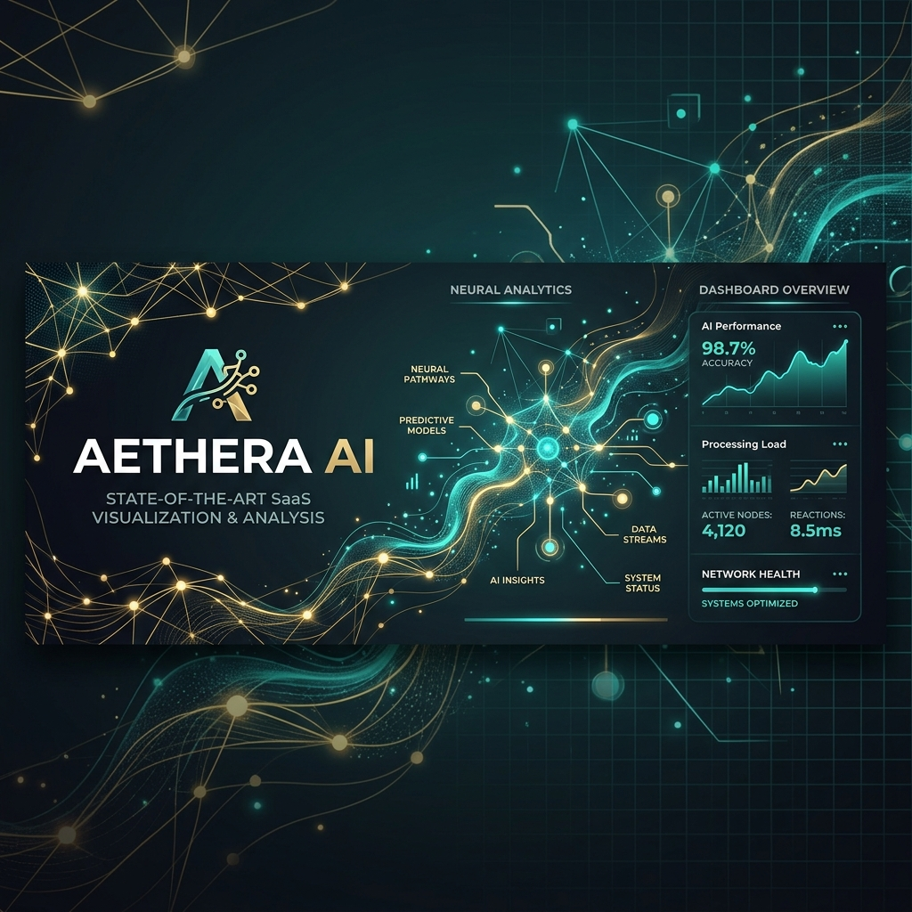

# Aethera AI — Next-Gen AI Agent Automation Platform



A highly cohesive, premium SaaS landing page built from scratch to showcase Aethera's decentralized autonomous agent networks. It demonstrates next-gen visual aesthetics, state-isolated multi-currency billing cycles, and responsive layout transitions.

---

## 🎨 Premium Visual Aesthetics

*   **Theme**: Built utilizing the **Oceanic Noir** design system constraints:
    *   `Oceanic Noir` (`#172B36`) — Primary Deep Slate-Blue Background
    *   `Nocturnal Expedition` (`#114C5A`) — Muted Secondary Containers & Borders
    *   `Arctic Powder` (`#F1F6F4`) — Crisp, High-Contrast Body Text
    *   `Mystic Mint` (`#D9E8E2`) — Sleek Secondary Text & Highlights
    *   `Forsythia` (`#FFC801`) — Vivid Gold Call-to-Action Highlights
    *   `Deep Saffron` (`#FF9932`) — Warm Orange Easing Accents
*   **Typography**: Integrated Google Fonts:
    *   `JetBrains Mono` for futuristic status tags, code console streams, and monospaced indicators.
    *   `Inter` for interface elements and body text.
*   **Glassmorphic Design**: Layout features frosted backgrounds (`backdrop-filter`), glowing indicator meshes, and radial spotlight highlights that track the user's cursor dynamically.

---

## ⚙️ Core Technical Features

### 1. Matrix-Driven Pricing & State Isolation
*   Pricing cycles switch between **Monthly** and **Annual** (incorporating a flat 20% discount multiplier).
*   Supports three core regions: **USD ($)**, **EUR (€)**, and **INR (₹)**.
*   Prices are computed dynamically via a multi-dimensional pricing matrix:
    $$\text{Final Price} = \text{Base Price} \times \text{Currency Rate} \times \text{Billing Discount}$$
*   **Strict State Isolation Guardrail**: Recalculating prices modifies only the target text nodes (`nodeValue`) of the currency symbol and price labels. No parent component reflows, re-renders, or paint flashes are triggered under Chrome DevTools, maintaining maximum runtime performance.

### 2. Bento-to-Accordion Layout & Context Lock
*   A single cohesive HTML DOM tree serves as both the desktop **Bento Grid** and mobile **Accordion List** to ensure maximum SEO crawlablity.
*   **Context Lock Synchronization**: Hovering or selecting any bento item on desktop (e.g. Card 2, "Cognitive Memory Layer") updates the active index. If the browser window resizes past the mobile `768px` breakpoint, the corresponding accordion panel automatically opens. Bi-directional sync updates the highlighted desktop card when an accordion header is clicked.
*   **Interactive Visual modules**:
    *   *Autonomous Workflow Engine (Card 0)*: Simulated async flowchart node pathing.
    *   *State-Preserving Router (Card 1)*: Real-time scrolling network terminal console.
    *   *Cognitive Memory Layer (Card 2)*: Canvas-based 3D orbital particle vector field that accelerates on cursor hover.
    *   *Neural Pipeline Parser (Card 3)*: Live interactive natural language command parser.

### 3. Orchestration & Performance (<500ms Cap)
*   **Intro Bootloader Overlay**: Runs a snapping mock terminal bootloader animation and fades out in `<300ms`.
*   **Staggered Entry**: All section headers, grid cards, and price blocks execute a staggered CSS keyframe transform and fade-in, completing entirely within `500ms` for immediate Time to Interactive (TTI).

---

## 🛠️ Local Installation & Running

Ensure you have **Node.js (v18+)** installed.

```bash
# Clone the repository
git clone https://github.com/DIPANSHU66/TASK.git
cd TASK

# Install dependencies
npm install

# Run the local development server (Vite)
npm run dev

# Compile optimized static bundle for production
npm run build
```

---

## 🚀 Deployed CI/CD Page
*   **Live URL**: [https://dipanshu66.github.io/TASK/](https://dipanshu66.github.io/TASK/)
*   **Automation**: Uses GitHub Actions (`deploy.yml`) to build and push target outputs to GitHub Pages.
